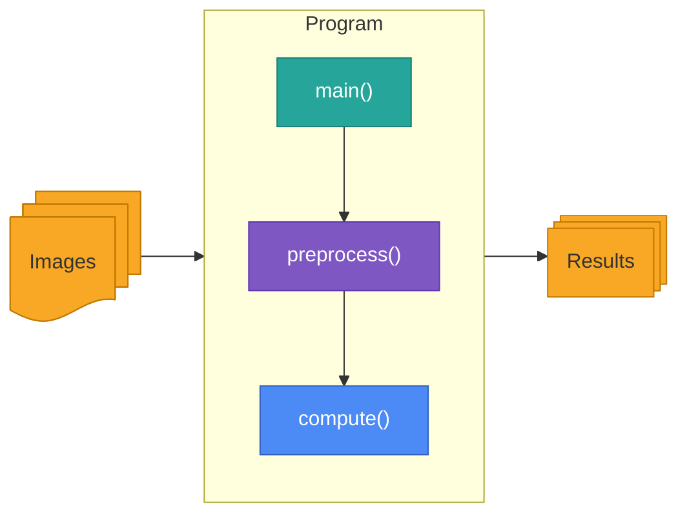
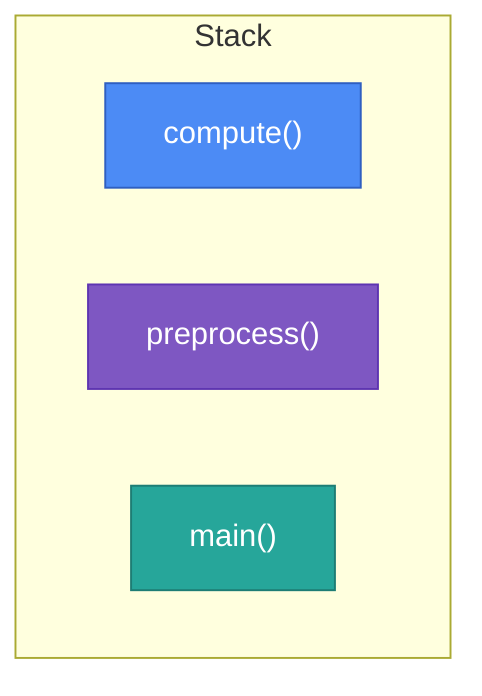
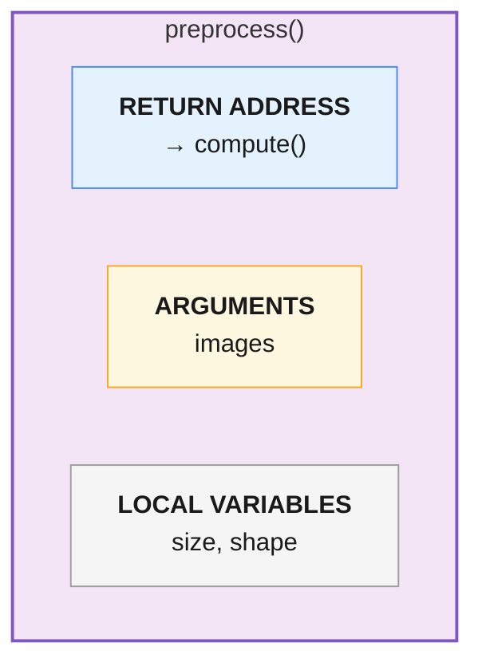
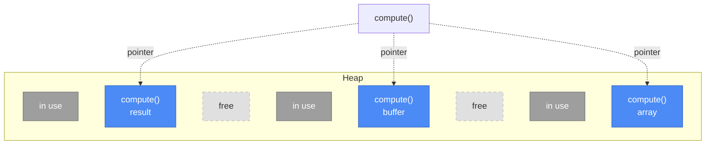

# Computer Science

## Stack

The stack is a region of preallocated memory on a RAM stick. The stack is last-in, first-out. A good way to understand this is through the call stack of a program. For example, a program's call stack might look like this:

In the stack, the `main()` function is loaded first, followed by the rest of the call chain.

Each block on the stack contains some simple information about the function, such as where to return when the function is done, arguments, and any variables this function is using.

So the call stack, read from bottom to top, preprocesses some data (e.g., transforms and normalises some images), then runs a computation on it (e.g., runs a convolution). Despite the `main()` function being loaded first, it is the last to leave the stack (at the conclusion of the program). A pointer sits at the top of the stack, so that the processor always knows what function is being run.

A `stack overflow error` occurs when the stack exhausts all available memory. This is most commonly observed during recursion, where the stack is populated by many copies of a single function.

On Linux, the stack defaults to 8MB. On Windows, the stack is only 1MB, which means deeply recursive programs will crash faster.

> [*"Smashing the Stack for Fun and Profit"*](https://phrack.org/issues/49/smashing-the-stack-for-fun-and-profit_md) is a famous paper published in [Phrack Magazine](https://phrack.org) detailing how to corrupt the execution stack by writing past the end of an array declared auto in a routine.

## Heap

The heap exists on the same RAM as the stack, but its function is very different. The heap is an unordered block of memory. Programs may store information in the heap wherever they can make it fit. The heap is useful for programs that need to share information between functions.

Unlike the stack, `compute()`'s blocks are scattered non-contiguously across the heap, wherever free space is available, and `compute()` keeps a pointer to each one. The grayed-out blocks are memory in use by other parts of the program; the dashed blocks are free.

Unlike the stack, data in the heap does not automatically clear upon use. This memory must be allocated and freed upon the conclusion of the program. When data is not properly freed, memory leaks occur and the device will eventually crash. Some languages, such as Python, include a garbage collector that will automatically perform this memory allocation and free for you.
