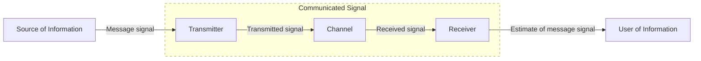
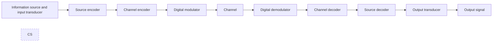

# Digital Communications

## Communication System

## Analog versus Digital

In analog communiciations, the transmitted message is a modulated electrical signal.

> ***Note:***
>
> *In modulation, a waveform is used to represent the transmitted bit. By altering waveform frequency, amplitude, and phase different bits and sequences of bits may be encoded.*

In digital communications, the transmitted message is a sequence of binary data.

## Digital Communication System

