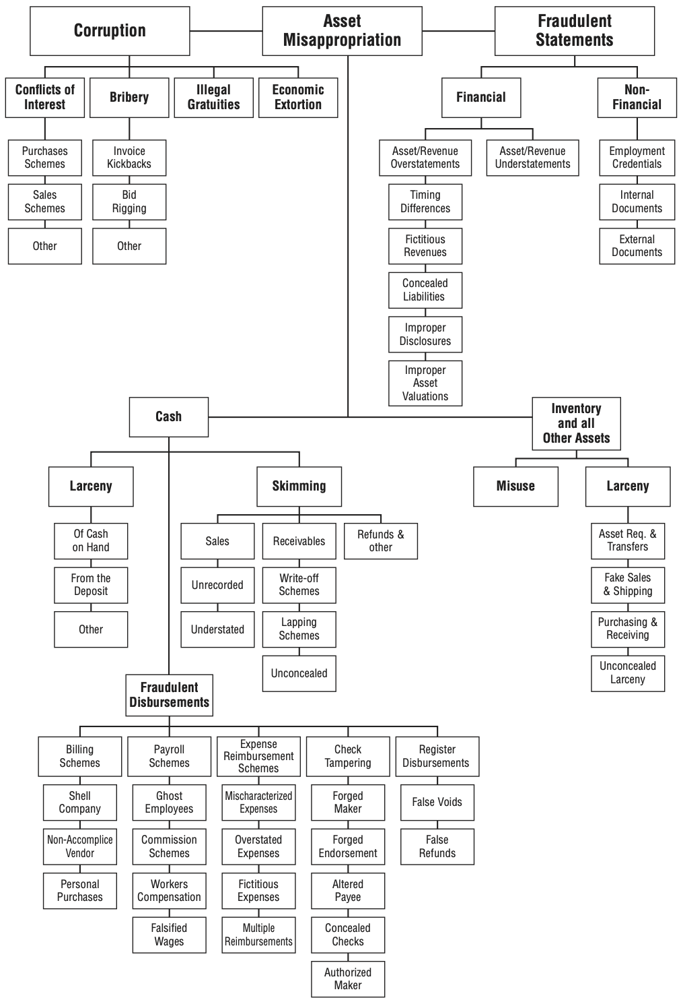
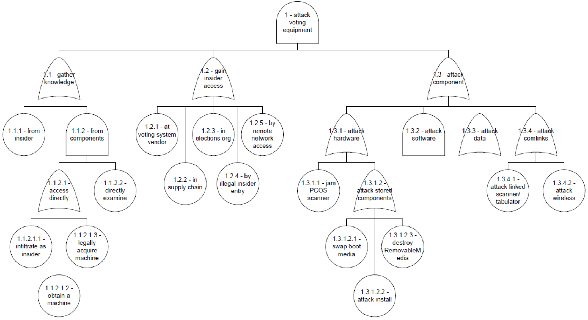
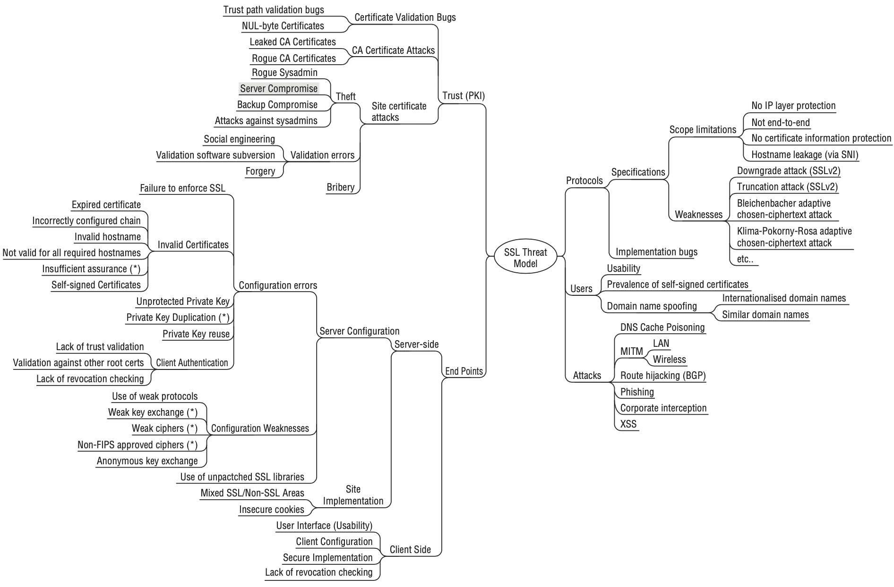

# Real-World Attack Trees

Several published attack trees provide valuable reference material.

## Fraud Attack Tree

## Election Threat Trees

## SSL Mind Map

### Observations

- Flexible but less structured
- Harder to navigate visually
- Inconsistent categorisation
