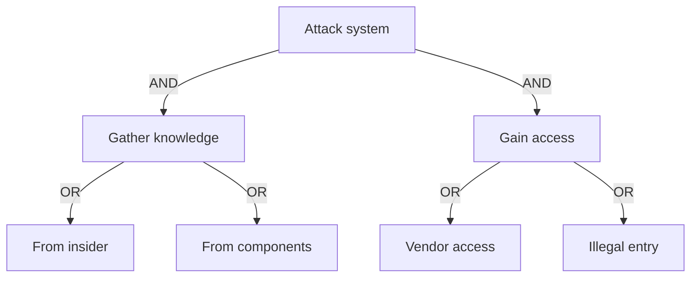

# Representing Attack Trees

Attack trees can be represented in different formats depending on the audience and purpose.

## Graphical Representation

## Outline Format

1. Attack system (AND)

    1.1 Gather knowledge (OR)

    * Insider
    * Components

    1.2 Gain access (OR)

    * Vendor
    * Illegal entry

## Structured Representations

Attack trees can also be treated as data structures.

Benefits:

* Programmatic analysis
* Cost modeling
* Risk quantification

Some tools allow:

* Assigning cost to nodes
* Simulating attacker capabilities

Useful for complex systems or large-scale analysis.
