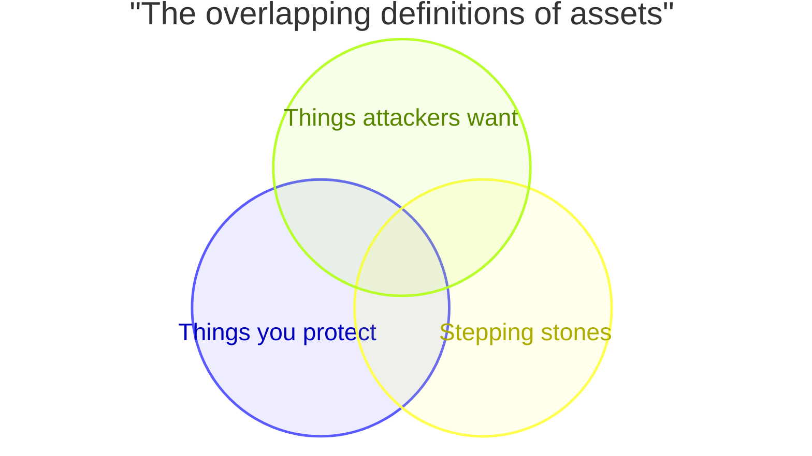

# Focusing on Assets

An asset-focused approach to threat modeling-centering on “things of value" seems intuitive but is often less effective than expected.

* **How asset-centric modeling works:**

  1. identify assets;
  2. map them to systems;
  3. model interactions;
  4. analyse threats.

* **Definition ambiguity:** “Assets” can mean three overlapping things:

  1. Things attackers want (e.g., passwords, financial data)
  2. Things you want to protect (often intangible, like reputation)
  3. Stepping stones to other assets (e.g., systems that provide access)

* **Practical challenges:**

  * Teams often lack a shared definition, leading to confusion or unproductive discussions.
  * Many assets (especially stepping stones) are too broad to be useful if listed exhaustively.

* **Core limitation:**

  * There’s no direct or systematic path from identifying assets to identifying threats.
  * Time spent cataloguing assets can detract from actually discovering and mitigating threats.

* **Where it helps:**

  * Experienced security teams may use assets effectively as a structuring tool.
  * Assets can assist in prioritising threats-but this typically emerges naturally during threat analysis, not from starting with assets.

Asset-centric thinking can provide context, but it shouldn’t be the primary driver of threat modeling. If identifying assets doesn’t directly improve your ability to find or address threats, it’s not a worthwhile focus.
