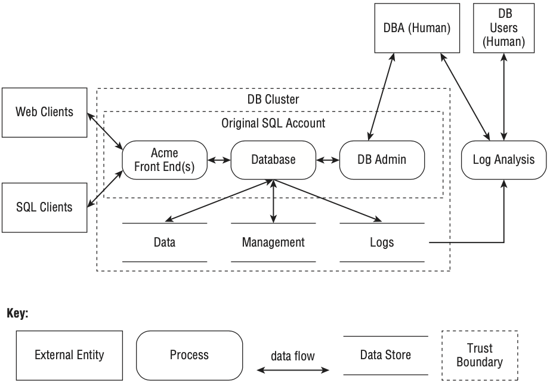

# Data Flow Diagrams

Data flow models are often the most effective way to perform threat modeling because security issues tend to follow **data flow**, not control flow. They can be applied to both networked systems and standalone software.

A Data Flow Diagram (DFD) is a structured representation of how data moves through a system. DFDs model:

* **Processes** (running code)
* **Data stores** (where data is held)
* **Data flows** (communication paths)
* **External entities** (outside the system boundary)

They are especially effective because they:

* Provide a **clear, shared model** of the system
* Highlight **interactions and trust boundaries**
* Make it easier to systematically identify **threats along data paths**

## Key Characteristics

* Data flows are typically shown as **one-way arrows**, even though real communication is often bidirectional.
* This simplification exists because **threats are asymmetric** (e.g., inbound vs outbound data exposure risks differ).
* DFDs do **not clearly distinguish** between:

  * Channel security (e.g., TLS, SMTP)
  * Message security (e.g., contents of an email)
    → For this distinction, **swim lane diagrams** may be more appropriate.

## Core Elements of a DFD

| Element | Description | Examples |
| --- | --- | --- |
| **Process** | Any executing code | Application services, APIs |
| **Data Flow** | Movement of data between components | HTTP requests, RPC calls |
| **Data Store** | Persistent storage | Databases, files, registries |
| **External Entity** | Actors outside system control | Users, third-party services |

### Modern DFD Improvements

Compared to classic DFDs, modern diagrams often:

* Use **rounded rectangles** for processes (better readability than circles)
* Prefer **straight lines** over curved ones (clearer at scale)
* Introduce **trust boundaries** to highlight security domains
