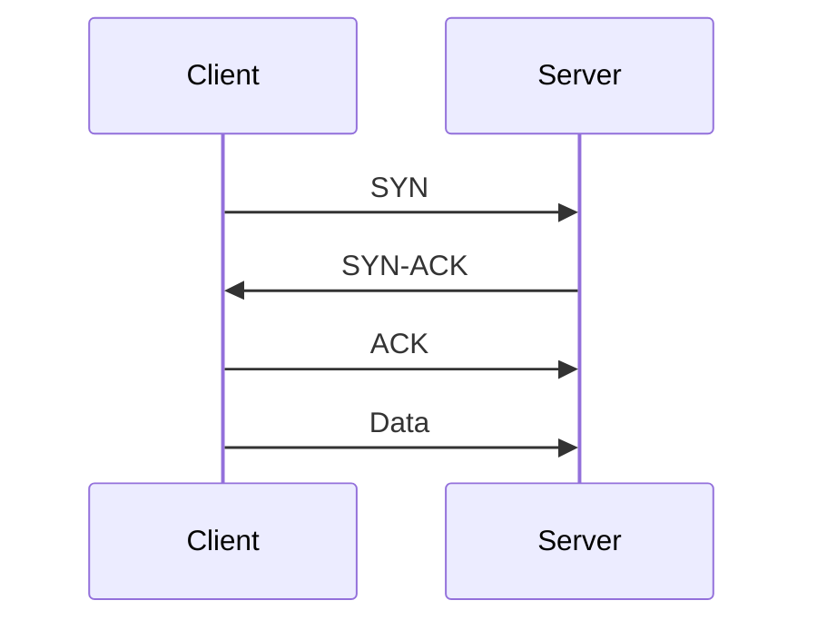

# Swim Lane Diagrams

Swim lane diagrams are a visual method for modeling **interactions between participants** in a system or protocol. They are particularly useful for understanding **message flows over time**.

* Each **participant** (e.g., client, server) is represented by a vertical “lane”
* **Time flows downward** along each lane
* **Messages** are shown as horizontal arrows between participants
* Each lane is **labeled** to identify the participant

This layout resembles swimming lanes, hence the name.

Swim lane diagrams complement data flow diagrams by emphasising **who communicates with whom and in what order**, making them especially useful for analysing protocols and interaction-driven threats.

## Key Features

* **Message labeling:**

  * Each interaction should include details about the message contents
  * For complex systems, a legend/key can be used to simplify representation

* **Computation and state:**

  * Internal processing or state changes should be annotated along the participant’s lane

* **Implicit trust boundaries:**

  * Each participant is typically a separate entity (e.g., different machines)
  * This naturally introduces **trust boundaries** between lanes

## Extensions

* Swim lanes can be extended to include **human participants**, not just systems
* This approach, called **“ceremonies”** (by Carl Ellison), helps model:

  * What users know
  * What users do
  * Human interactions in security-sensitive processes

## When to Use Swim Lane Diagrams

* When **timing and sequence** of interactions matter
* When analyzing **protocol behavior**
* When distinguishing between **participants and their responsibilities**
* When modeling **human + system interactions**
