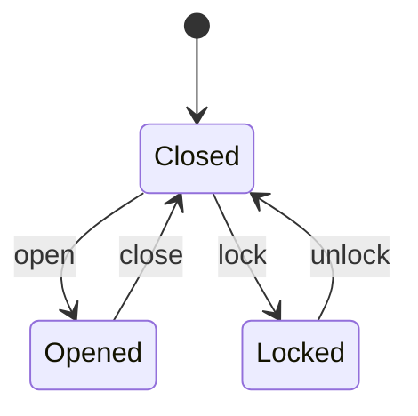

# State Diagrams

State diagrams model a system as a set of **states** and **transitions** between those states. They are useful for analysing how a system behaves in response to inputs and how it enforces rules over time. 

A system is represented as a **state machine** with:

  * **States** (current condition of the system)
  * **Transitions** (movement between states)
  * **Inputs/messages** that trigger transitions
  * **Internal data/memory** influencing behavior

From a threat modelling perspective, state diagrams can help to evaluate whether **each transition enforces proper validation and security checks**, and to identify:

* invalid or unexpected transitions
* missing validation on inputs
* states that should not be reachable.

This helps uncover logic flaws and state-based vulnerabilities.

## Key Features

* Each **state** is shown as a labeled node.

* Each **transition** is shown as an arrow labeled with the condition or event that triggers it.

## Considerations

State diagrams can become **complex quickly** as more states and transitions are added. Simpler models are generally:

  * easier to reason about
  * easier to secure
  * more reflective of good system design.

Overly complex state spaces (e.g., ambiguous states like “ajar”) increase:

  * implementation difficulty
  * risk of security gaps.
