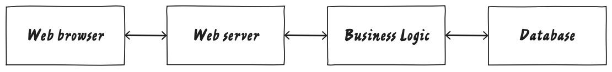
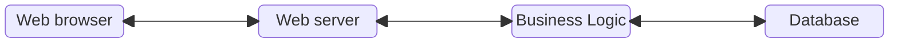
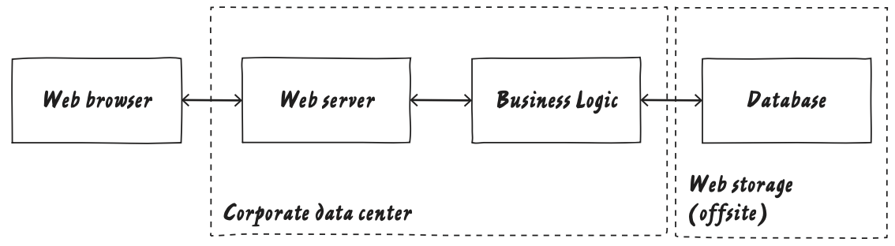
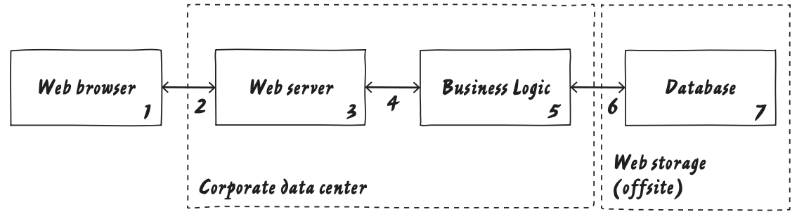

# Model

In order to protect something, you must first have a understand what that something is.

Start with a block diagram of how data flows through the system at the highest possible level.

Add *trust boundaries* to show who controls what.

> **Note:**
>
> *A **trust boundary** is formed at wherever people control different things. Some typical examples of trust boundaries include accounts, network interfaces, different physical computers, virtual machines, organisational boundaries, etc.*

At this point, it is probably helpful to label data flows.

You should think of threat model diagrams as a part of the development process, so try to keep your diagram in version control with the rest of your project.

> ## **Tips:**
>
> * Don’t have data sinks: You write the data for a reason. Show who uses it.
> * Data can’t move itself from one data store to another: Show the process that moves it.
> * Keep your diagram simple. For complicated parts of your system (e.g., diode structure), draw a separate diagram that focuses on just that block.
